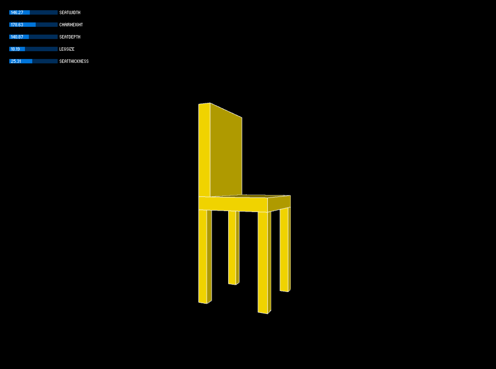
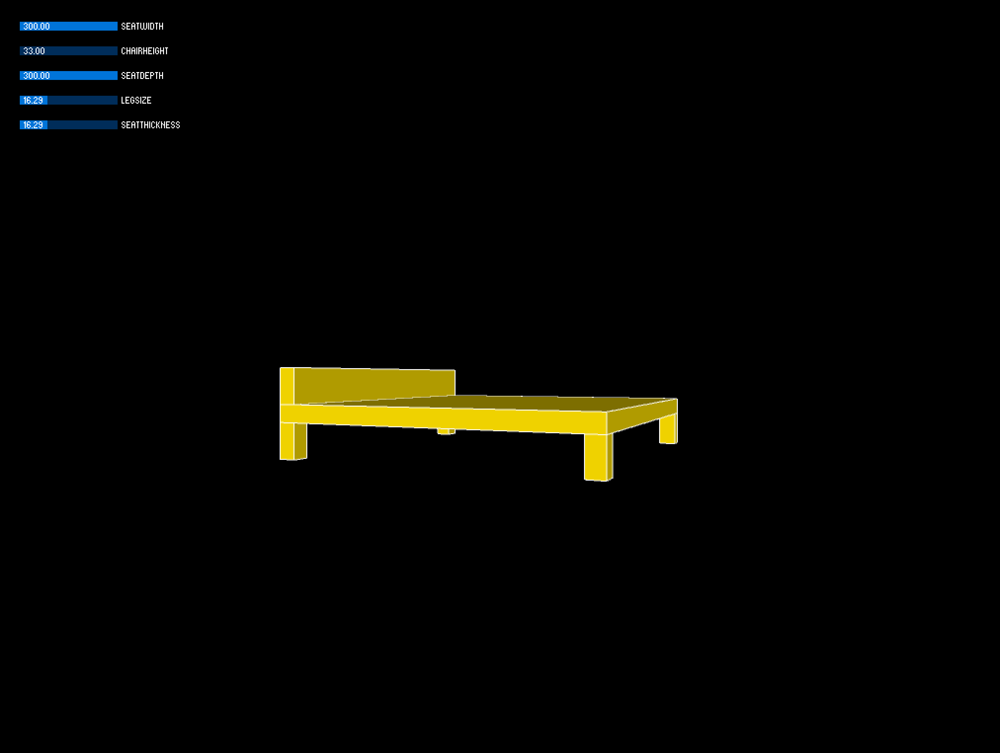
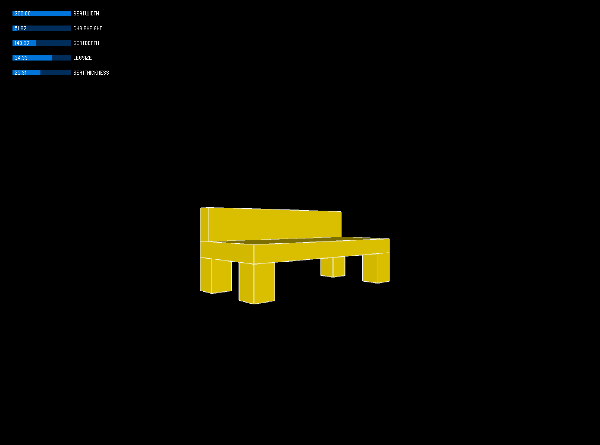

# ChairaForm

## Parametric Chair Visualizer

### Description

I began with a very simple chair form, with only three DOF: seat width, seat depth, and chair height. These were satisfactory, but as a chair designer, I want to have greater control over the size of the legs and the thickness of the seat and back cushions, so I added those parameters and associated rendering logic. I arrived at the constraints by tinkering and adjusting until the extremes still produce interesting chair designs.

### Surprise

I was surprised to discover that ChairaForm can also design decent couches, beds, settees. Happy accident.

### Screenshots

