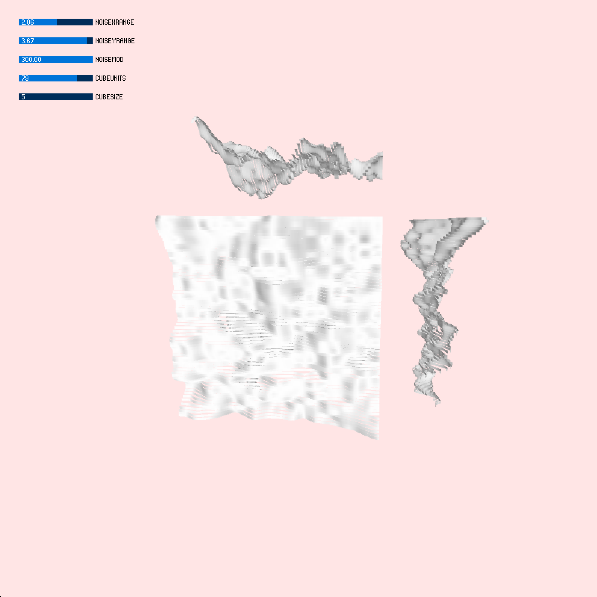

# Week 4 Homework: Interactive parametric form leveraging perlin noise

My goal is to use perlin noise to modulate the form of a cube. I appreciate how perlin noise can bear a similarity to natural terrain topography, and wanted to integrate this characteristic into a primitive shape. The rendering of the cube as separate faces was a development obstacle that actually resulted in some nice parametric forms, so I decided to convert that bug into a feature and roll with it.

I started by using a code example from Generative Gestaultung, http://www.generative-gestaltung.de/1/M_1_4_01

and also integrated some code from Jeremy Douglass, https://forum.processing.org/two/discussion/18996/how-to-draw-a-cube-with-triangle-strip

